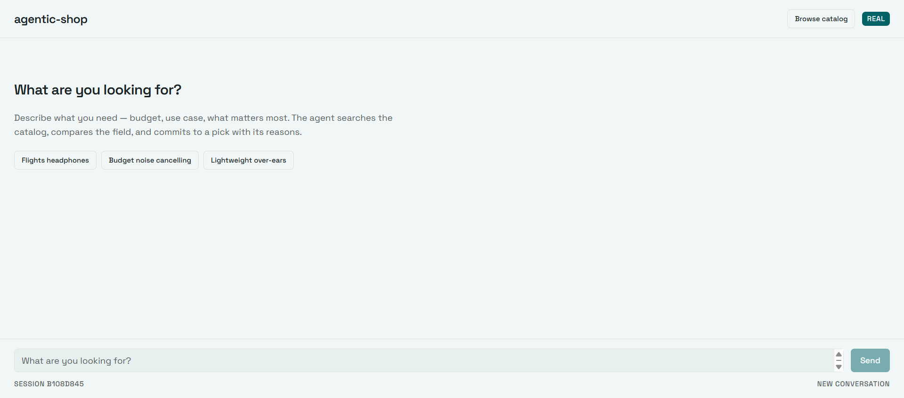
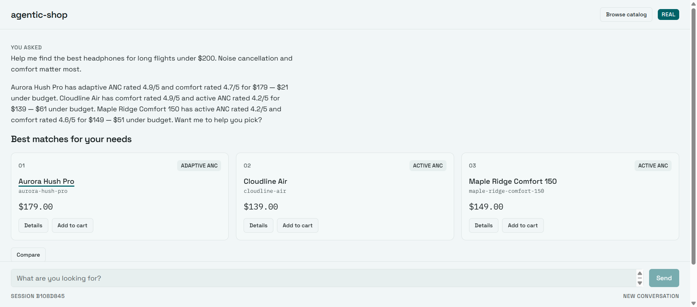
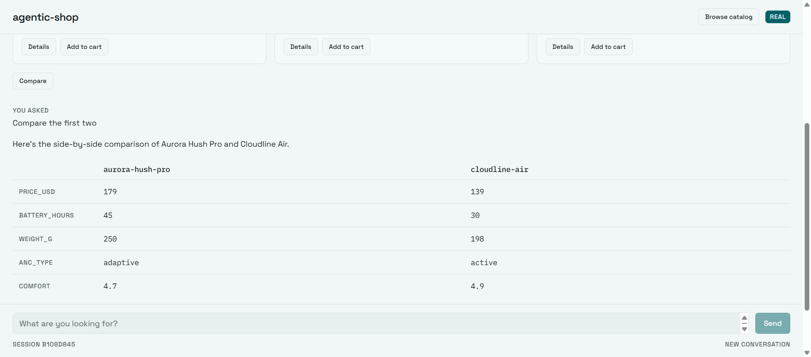
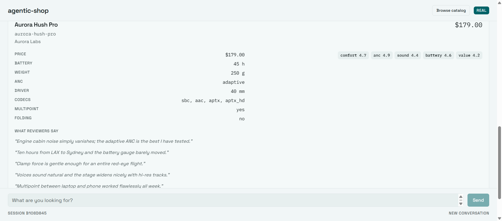
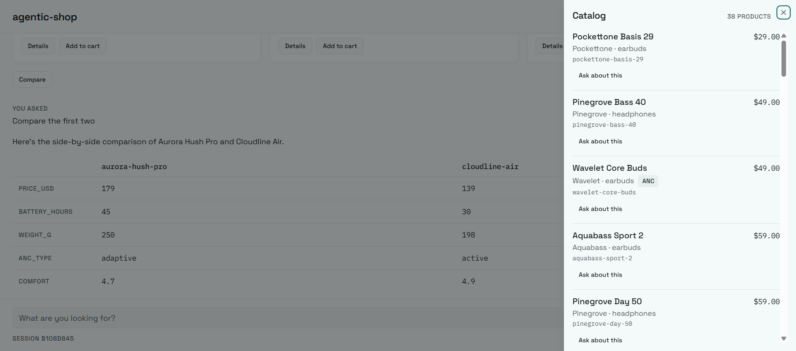
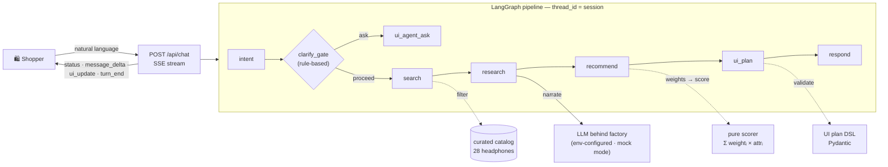

<h1 align="center">agentic-shop</h1>

<p align="center">
  <a href="#quickstart"></a>
  
  
  
  
  
  
  <a href="https://github.com/Zahrannnn/agentic-shop/pull/1"></a>
  <a href="https://github.com/Zahrannnn/agentic-shop/pull/4"></a>
</p>

<p align="center"><em>The UI is an output of the agent, not the place where the agent operates.</em></p>

An agentic shopping system: you state a goal in one sentence — *"best headphones for
long flights under $200, noise cancellation matters"* — and a LangGraph agent pipeline
searches a curated catalog, ranks products with a **deterministic scorer**, and streams
back a conversational answer plus a **validated UI plan** the client renders as grids,
comparisons, and cart views. No pages, no navigation — just a transcript.

> [!TIP]
> Everything runs **keyless and offline** in mock mode: the full agent pipeline, the
> SSE API, the frontend, and all 390 tests (224 backend + 166 frontend). Drop in an OpenCode Zen model when you want a real LLM.

**Explore:** [Quickstart](#-quickstart) · [Architecture](#architecture) · [System design](#system-design) · [Try the MVP scenario](#try-the-mvp-scenario) · [Design system](#design-system) · [Real model](#use-a-real-model)

---

## The app

| | |
|---|---|
|  |  |
| **The storefront** — light "Curator's Desk" surface, suggestion chips, Browse catalog, REAL/MOCK badge | **Recommendation turn** — streamed reasoning, ranked ecommerce cards with prices and ANC badges |
|  |  |
| **Comparison** — side-by-side attributes, values straight from the catalog | **Details** — full catalog snapshot card with reviewer quotes |
|  | |
| **Catalog sheet** — browse all 38 products, one tap asks the agent | |

Full-width layout, sticky composer, thinking skeletons while the model works, and a
REAL/MOCK mode badge — the transcript stays the only navigation.

> [!TIP]
> Building the frontend? **[FRONTEND_GUIDE.md](FRONTEND_GUIDE.md)** is the
> agent-ready contract: endpoints, SSE state machine, plan registry, and a
> definition of done — no backend code reading required.

---

## Features

- 🧠 **Agentic pipeline** — fixed LangGraph backbone (`intent → clarify_gate → search → research → recommend → ui_plan → respond`) with exactly one conditional edge; session state checkpointed per conversation.
- 📊 **Deterministic ranking** — the LLM proposes preference *weights* only; a pure, unit-tested scorer computes the order. Identical input ⇒ identical ranking (byte-identical in mock mode; in real mode the scorer is deterministic given the weights, which come from a temp-0 model call).
- 🎨 **UI as data** — every turn ends with one validated UI plan document (product grid, preference picker, comparison table, details, cart view). The agent can never emit executable code.
- 💬 **Streaming everything** — server-sent events with a first-class lifecycle (`status` → `message_delta` → `ui_update` → `turn_end`), so clients lock, render, and unlock on contract.
- 🛡️ **Fail-clean resilience** — schema-validated model outputs with exactly one retry feeding the validation error back; clean `error` events, never raw model text.

## Architecture



**Components** (each lives behind a small, single-purpose module):

| Module | Role |
|---|---|
| `backend/app/llm/` | The **only** doorway to any model: env-configured `ChatOpenAI`, deterministic `MockChatLLM`, and the validate → retry-once → fail-clean structured-output wrapper |
| `backend/app/catalog/` | Curated 38-product dataset (28 headphones + 10 earbuds) with pre-scored per-attribute reviews + 4–6 quotes each — research reads scores, never does runtime NLP |
| `backend/app/ranking/` | Pure `score_products()`: weighted min-max normalized attributes, lexicographic tie-break, byte-stable output |
| `backend/app/tools/` | `search_products` (with deterministic filter relaxation), pre-scored research, mock cart |
| `backend/app/graph/` | Typed `ShoppingState`, node implementations, builder with `MemorySaver` checkpointer |
| `backend/app/dsl/` | UI plan schemas + catalog-aware validation; camelCase wire format shared via `backend/fixtures/ui-plans/` |
| `backend/app/api/` | `/health` and `/api/chat`: D7 lifecycle framing, per-session 409 busy guard |

## System design

### The turn lifecycle (the D7 contract)

Every turn — answer, clarification, comparison, cart change — emits the same ordered
event stream, which is exactly what the future Next.js frontend renders against:

| Order | Event | Payload | Client behavior |
|---|---|---|---|
| 1 | `status` | `{"stage":"searching"}`, `{"stage":"found_n","count":14}`, … | lock previous plan, show stepper |
| 2 | `message_delta` | `{"text":"…"}` | stream the answer prose |
| 3 | `ui_update` | one full UI plan (below) | **replace** the previous plan — no patching |
| 4 | `turn_end` / `error` | `{}` / `{"message","code"}` | unlock |

Stages: `intent_parsed → searching → found_n → researching → ranking → building_ui`.

### What the agent emits (the UI DSL)

A plan is a tree of registry components — typed, bounded, and validated against the
catalog before it ever reaches the wire. The frontend renders it; nothing is executed.

```json
{
  "planVersion": "1",
  "sessionId": "demo-12345",
  "turnId": 3,
  "root": {
    "type": "product_grid",
    "props": {
      "title": "Best matches for your needs",
      "productIds": ["aurora-hush-pro", "cloudline-air", "maple-ridge-comfort-150"],
      "ranked": true
    },
    "actions": [
      { "type": "compare", "label": "Compare", "payload": {} },
      { "type": "details", "label": "Details", "payload": {} },
      { "type": "add_to_cart", "label": "Add to cart", "payload": {} }
    ]
  }
}
```

Registry: `product_grid` · `preference_picker` (clarify chips) · `comparison_table` ·
`product_details` · `cart_view` · `text_block`. Unknown types, foreign product ids,
out-of-bounds lists, and disallowed actions are rejected server-side — a bad plan
becomes one clean `error` event, never a broken client.

### Determinism where it matters, LLM where it helps

The model never decides order. It maps stated priorities to attribute weights; the
scorer does the rest, deterministically:

```text
score(p) = Σᵢ weightᵢ × minmax(attrᵢ)      # weights normalized to Σ = 1
                                           # cost attributes inverted; ties broken by id
```

The narration is grounded in the *computed* contributions — reasons cite real values
("45 h battery — the longest among your matches"), so explanations are checkable.

### Conversational memory and safety rails

- Sessions checkpoint in memory (`thread_id` = session id); follow-ups like *"compare
  the first two"* or *"add that one to my cart"* resolve positionally against the
  presented ranking.
- The clarify gate is a **rule table, not an LLM judgment**: unknown category ⇒ one
  chip question, never twice in a row; missing budget ⇒ proceed with a stated $250
  cap; impossible constraints ⇒ closest matches, honestly flagged.
- A second message while a turn is in flight gets `409 turn_in_flight` — sessions
  never interleave.
- Model hiccups degrade on-contract: schema failures retry once with the error fed
  back, then a single `error` event ends the turn.

## Quickstart

Requires Python 3.12 and [`uv`](https://docs.astral.sh/uv/). No API key needed.

Requires Python 3.12 + [`uv`](https://docs.astral.sh/uv/) for the backend and
Node 22 + npm for the frontend. No API key needed.

**Backend** (agent pipeline + SSE API):

```bash
git clone https://github.com/Zahrannnn/agentic-shop && cd agentic-shop/backend
uv sync
uv run pytest                          # 209 tests, fully offline (mock mode)
uv run uvicorn app.main:app --reload   # LLM_MODE=mock is the default
```

**Frontend** (transcript UI + plan renderer):

```bash
cd ../frontend
npm install
npm run verify                         # lint + typecheck + 136 vitest tests + build
npm run dev                            # open http://localhost:3000/shop
```

CORS is pre-wired for the Next.js dev ports; the shop page shows a `MOCK`/`REAL`
badge from the backend's `/health`.

> [!NOTE]
> Full walkthroughs — backend: [`specs/001-backend-agent-scaffold/quickstart.md`](specs/001-backend-agent-scaffold/quickstart.md);
> frontend: [`specs/002-frontend-ui-renderer/quickstart.md`](specs/002-frontend-ui-renderer/quickstart.md).

## Try the MVP scenario

```bash
curl -N -X POST http://127.0.0.1:8000/api/chat \
  -H "Content-Type: application/json" \
  -d '{"session_id":"demo-12345","message":"Help me find the best headphones for long flights under $200. Noise cancellation and comfort matter most."}'
```

```
event: status        data: {"stage":"intent_parsed"}
...
event: status        data: {"stage":"building_ui"}
event: message_delta data: {"text":"Aurora Hush Pro ($179): adaptive ANC rated 4.9/5..."}
...
event: ui_update     data: {"planVersion":"1","root":{"type":"product_grid",...}}
event: turn_end      data: {}
```

Then, in the same session: *"compare the first two"* → a `comparison_table` plan;
*"add the first one to my cart"* → a `cart_view` plan. The whole search → refine →
compare → recommend → cart loop happens inside the transcript.

Prefer clicking over curling? Start the frontend (`npm run dev` →
`http://localhost:3000/shop`) and run the same scenario in the browser — the UI
renders every plan the agent streams.

## Design system

The frontend has an opinionated visual identity — **"The Curator's Desk"** — encoded
in two files every FE change must honor: [`PRODUCT.md`](PRODUCT.md) (register, users,
the confident-curator voice, named anti-references) and [`DESIGN.md`](DESIGN.md)
(tokens, type scale, elevation, named rules like *The One Underline Rule* and *The
Paper Rule*).

Implementation lives in `frontend/src/app/globals.css` as OKLCH tokens: warm **Paper**
neutrals tinted toward a single **Teal Ink** accent (spent only where the agent
commits), hairline borders over shadows, Space Grotesk + IBM Plex Mono, and a
`prefers-reduced-motion` collapse. The anti-slop bans are doctrine: no purple-blue
gradients, no glass cards, no side-stripe borders, no hero-metric template, no
identical card grids.

---

## Use a real model

All model access is env-configured behind `backend/app/llm/client.py` — swap models
without touching code. Example with a free [OpenCode Zen](https://opencode.ai/docs/zen/)
model (see `backend/.env.example`):

```bash
LLM_MODE=real
LLM_MODEL=muse-spark-1.2-contributor-free
OPENCODE_BASE_URL=https://opencode.ai/zen/v1
OPENCODE_API_KEY=<your-key>
LLM_API_STYLE=responses        # muse is a Responses-API-only reasoning model
```

> [!IMPORTANT]
> Never commit `.env` or any key. The structured-output wrapper automatically falls
> back to schema-in-prompt JSON mode for models that reject strict schemas (like
> muse), so swapping providers stays a one-line change.

## Project structure

```text
├── PRD.md                             product requirements (v0.1 MVP)
├── DECISIONS.md                       locked architecture decisions (binding, D1–D8)
├── AGENTS.md                          crew guide for coding agents
├── PRODUCT.md / DESIGN.md             impeccable design context (Curator's Desk system)
├── FRONTEND_GUIDE.md                  agent-ready backend contract for FE implementers
├── specs/001-backend-agent-scaffold/  backend spec · research · plan · contracts · tasks
├── specs/002-frontend-ui-renderer/    frontend spec · research · plan · data-model · tasks
├── docs/screenshots/                  the app in action (light Curator's Desk)
├── .specify/                          GitHub Spec Kit (constitution, templates)
├── backend/
│   ├── app/llm/          model factory · mock mode · structured-output wrapper
│   ├── app/catalog/      curated dataset · Pydantic models · loader
│   ├── app/ranking/      the pure deterministic scorer
│   ├── app/tools/        search · pre-scored research · mock cart
│   ├── app/graph/        state · nodes · followups · builder (MemorySaver)
│   ├── app/dsl/          UI plan schemas · validation
│   ├── app/api/          /health · /api/chat (SSE)
│   ├── fixtures/ui-plans/  shared plan contract corpus
│   └── tests/            209 tests: scorer, tools, DSL, SSE contract, graph, config
└── frontend/            corelia-next-boilerplate — detailed guide: frontend/README.md (Next.js 16 · React 19 · Tailwind v4)
    ├── src/features/shopping/   the whole feature: api/ (SSE client, frame parser),
    │                            hooks/ (use-agent-turn), store/ (RTK slices),
    │                            validations/ (Zod plan mirror), components/ (renderer
    │                            registry + transcript UI), utils/
    ├── src/components/ui/       shadcn primitives (theme = Curator's Desk tokens)
    ├── src/shared/              env config · store composition · providers
    └── ...                      vitest setup, husky, Docker/CI infra
```

## Development

**Backend** (`cd backend`):

```bash
uv sync
uv run ruff check .
uv run ruff format --check .
uv run pytest
```

**Frontend** (`cd frontend`):

```bash
npm install
npm run verify        # eslint + tsc --noEmit + vitest + next build
```

- **Hooks**: root `uv tool install pre-commit && pre-commit install` (ruff + hygiene);
  `frontend/` ships its own husky + lint-staged via `npm install`.
- **Flow**: feature work goes through Spec Kit (`$speckit-specify` → plan → tasks →
  implement); every plan is gated against the project constitution
  (`.specify/memory/constitution.md`).
- **Design**: frontend work follows `PRODUCT.md` + `DESIGN.md` (the Curator's Desk
  doctrine — restrained light palette, one teal-ink accent, editorial type, the
  named anti-slop bans).
- **Commits**: Conventional Commits, small focused PRs (PR template included).
- **Next up**: Phase 2 polish — real-mode latency UX, catalog browsing beyond the
  flights scenario, and the V2 backlog (plan patching, more categories).
