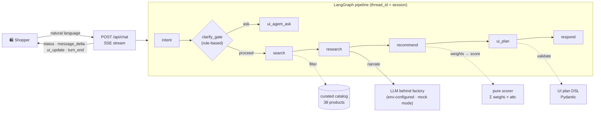

<h1 align="center">agentic-shop</h1>

<p align="center">
  <a href="#quickstart"></a>
  
  
  
  
  
  
  <a href="https://github.com/Zahrannnn/agentic-shop/pull/1"></a>
  <a href="https://github.com/Zahrannnn/agentic-shop/pull/4"></a>
</p>

<p align="center"><em>"The UI is an output of the agent, not the place where the agent operates."</em></p>

This is my first practice project for Agentic Frontend: a shopping experience where
you skip the catalog pages entirely and just tell an agent what you need. Say
*"headphones for long flights under $200, noise cancellation matters"* and a LangGraph
pipeline searches a curated catalog, ranks products with a deterministic scorer, and
streams back an answer plus a validated UI plan that the client renders as grids,
comparisons, and cart views.

I built it to learn the agentic frontend patterns end to end: planning with GitHub
Spec Kit, a Python/LangGraph backend, a Next.js renderer, and the contract between
them. Every feature went through a spec → plan → tasks → implement cycle, and both
suites (391 tests) run offline in mock mode.

> [!TIP]
> Everything runs **keyless and offline** in mock mode: the full agent pipeline, the
> SSE API, the frontend, and the whole test suite. Drop in an OpenCode Zen model when
> you want a real LLM.

**Explore:** [Quickstart](#quickstart) · [Architecture](#architecture) · [System design](#system-design) · [Try the MVP scenario](#try-the-mvp-scenario) · [Design system](#design-system) · [Real model](#use-a-real-model)

---

## The app

| | |
|---|---|
|  |  |
| The storefront: light "Curator's Desk" surface, suggestion chips, Browse catalog, REAL/MOCK badge | Recommendation turn: streamed reasoning, ranked ecommerce cards with prices and ANC badges |
|  |  |
| Comparison arena: spec scoreboard with win counts and Best cells, values straight from the catalog | Details: full catalog snapshot card with reviewer quotes |
|  | |
| Catalog sheet: browse all 38 products, one tap asks the agent | |

Full-width layout, sticky composer, thinking skeletons while the model works, and a
REAL/MOCK mode badge. The transcript is the only navigation.

> [!TIP]
> Building a frontend against this? **[FRONTEND_GUIDE.md](FRONTEND_GUIDE.md)** is the
> agent-ready contract: endpoints, SSE state machine, plan registry, and a
> definition of done. No backend code reading required.

---

## How it works



A few decisions I care about here:

**The LLM never decides order.** It maps your stated priorities to attribute weights;
a pure, unit-tested scorer computes the ranking. Same input, same ranking, every time
(byte-identical in mock mode).

**Plans are data, not code.** Every turn ends with one validated UI plan document. The
backend rejects unknown component types, foreign product ids, and out-of-bounds lists
before anything reaches the wire, so the client never renders a broken plan.

**Failures degrade on contract.** Schema failures retry once with the validation error
fed back to the model, then a single clean `error` event ends the turn. You never see
raw model output.

The clarify gate is a rule table, not a model judgment: unknown category gets one chip
question (never twice in a row), a missing budget proceeds with a stated $250 cap, and
impossible constraints get the closest matches with the trade-off honestly flagged.

## Quickstart

Backend needs Python 3.12 and [uv](https://docs.astral.sh/uv/). Frontend needs
Node 22 and npm. No API key needed for mock mode.

```bash
git clone https://github.com/Zahrannnn/agentic-shop && cd agentic-shop

# backend: agent pipeline + SSE API (224 tests, fully offline)
cd backend
uv sync
uv run pytest
uv run uvicorn app.main:app --reload   # LLM_MODE=mock is the default

# frontend: transcript UI + plan renderer (167 tests)
cd ../frontend
npm install
npm run verify                         # lint + typecheck + vitest + build
npm run dev                            # http://localhost:3000/shop
```

CORS is pre-wired for the Next.js dev ports, and the shop page shows a MOCK/REAL
badge from the backend's `/health`.

> [!NOTE]
> Longer walkthroughs: [backend quickstart](specs/001-backend-agent-scaffold/quickstart.md)
> and [frontend quickstart](specs/002-frontend-ui-renderer/quickstart.md).

## Try the MVP scenario

```bash
curl -N -X POST http://127.0.0.1:8000/api/chat \
  -H "Content-Type: application/json" \
  -d '{"session_id":"demo-12345","message":"Help me find the best headphones for long flights under $200. Noise cancellation and comfort matter most."}'
```

```text
event: status        data: {"stage":"intent_parsed"}
...
event: message_delta data: {"text":"Aurora Hush Pro ($179): adaptive ANC rated 4.9/5..."}
...
event: ui_update     data: {"planVersion":"1","root":{"type":"product_grid",...}}
event: turn_end      data: {}
```

Then, in the same session: *"compare the first two"* gives you a comparison table,
*"add the first one to my cart"* gives you a cart view. The whole search → refine →
compare → recommend → cart loop stays inside the transcript.

Prefer clicking? `npm run dev` in `frontend/`, open `http://localhost:3000/shop`, and
run the same scenario with the suggestion chips.

## Design system

The frontend follows a small written doctrine, "The Curator's Desk", captured in
[PRODUCT.md](PRODUCT.md) (voice, users, anti-references) and [DESIGN.md](DESIGN.md)
(OKLCH tokens, type scale, named rules like *The One Underline Rule* and *The Paper
Rule*). Implementation lives in `frontend/src/app/globals.css`: warm cream neutrals,
a single coral accent spent only where the agent commits, hairline borders over
shadows, Space Grotesk + IBM Plex Mono. The anti-slop bans are written down and
enforced: no purple-blue gradients, no glass cards, no side-stripe borders, no
hero-metric template.

## Use a real model

All model access is env-configured behind `backend/app/llm/client.py`, so swapping
models is a `.env` change. A free example on [OpenCode Zen](https://opencode.ai/docs/zen/):

```bash
LLM_MODE=real
LLM_MODEL=muse-spark-1.2-contributor-free
OPENCODE_BASE_URL=https://opencode.ai/docs/zen/
OPENCODE_BASE_URL=https://opencode.ai/zen/v1
OPENCODE_API_KEY=<your-key>
LLM_API_STYLE=responses        # muse is a Responses-API-only reasoning model
```

> [!IMPORTANT]
> Never commit `.env` or any key. The structured-output wrapper falls back to
> schema-in-prompt JSON mode for models that reject strict schemas (muse is one), so
> swapping providers stays a config change.

## Project structure

```text
├── PRD.md                             product requirements (v0.1 MVP)
├── DECISIONS.md                       locked architecture decisions (binding, D1–D8)
├── AGENTS.md                          crew guide for coding agents
├── PRODUCT.md / DESIGN.md             design context (Curator's Desk system)
├── FRONTEND_GUIDE.md                  agent-ready backend contract for FE implementers
├── specs/001-backend-agent-scaffold/  backend spec · research · plan · contracts · tasks
├── specs/002-frontend-ui-renderer/    frontend spec · research · plan · data-model · tasks
├── docs/screenshots/                  the app in action (light Curator's Desk)
├── .specify/                          GitHub Spec Kit (constitution, templates)
├── backend/                           detailed guide: backend/README.md
│   ├── app/llm/          model factory · mock mode · structured-output wrapper
│   ├── app/catalog/      curated dataset · Pydantic models · loader
│   ├── app/ranking/      the pure deterministic scorer
│   ├── app/tools/        search · pre-scored research · mock cart
│   ├── app/graph/        state · nodes · followups · builder (MemorySaver)
│   ├── app/dsl/          UI plan schemas · validation
│   ├── app/api/          /health · /api/chat (SSE)
│   ├── fixtures/ui-plans/  shared plan contract corpus
│   └── tests/            224 tests: scorer, tools, DSL, SSE contract, graph, config
└── frontend/            detailed guide: frontend/README.md (Next.js 16 · React 19 · Tailwind v4)
    ├── src/features/shopping/   the whole feature: api/ (SSE client, frame parser),
    │                            hooks/ (use-agent-turn), store/ (RTK slices),
    │                            validations/ (Zod plan mirror), components/ (renderer
    │                            registry + transcript UI), utils/
    ├── src/components/ui/       shadcn primitives (theme = Curator's Desk tokens)
    ├── src/shared/              env config · store composition · providers
    └── ...                      vitest setup, husky, Docker/CI infra
```

## Development

**Backend** (`cd backend`):

```bash
uv sync
uv run ruff check .
uv run ruff format --check .
uv run pytest
```

**Frontend** (`cd frontend`):

```bash
npm install
npm run verify        # eslint + tsc --noEmit + vitest + next build
```

- **Hooks**: root `uv tool install pre-commit && pre-commit install` (ruff + hygiene);
  `frontend/` ships its own husky + lint-staged via `npm install`.
- **Flow**: feature work goes through Spec Kit (`$speckit-specify` → plan → tasks →
  implement); every plan is gated against the project constitution
  (`.specify/memory/constitution.md`).
- **Design**: frontend work follows `PRODUCT.md` + `DESIGN.md` (warm cream palette,
  one coral accent, editorial type, the named anti-slop bans).
- **Commits**: Conventional Commits, small focused PRs (PR template included).
- **Next up**: more catalog categories, richer comparison state, and eventually real
  product APIs. The full deferred list lives in `DECISIONS.md`.
